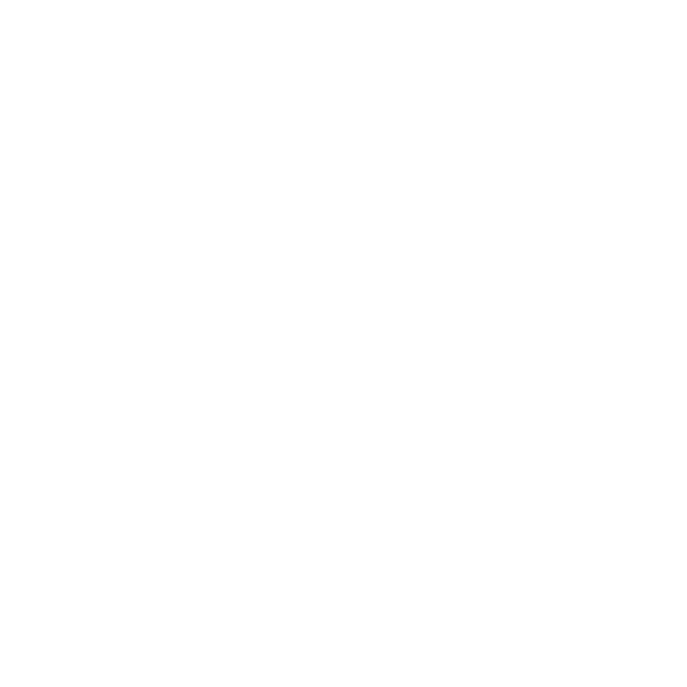

# Nearby

Projeto feito com base no design feito pela Rocketseat para o evento NLW-Nearby, que é um aplicativo que serve para as pessoas terem noções de localização de estabelecimentos com base em sua categoria. Esse aplicativo fictício serviu para eu continuar desenvolvendo minhas habilidades com React Native e desenvolvimento de aplicativos, principalmente focado em pontos como uso de mapas e serviços externos do Google Cloud Platform, microinterações que trazem feedback sonoro e visual ao usuário e animações para trazer fluidez para o app

## Funcionalidades

- [x] Listar todas as lojas com base em uma categoria (Alimentação, Cinema, Hospedagem)
- [x] Microinterações e Animações com o BottomSheet e o mapa
- [x] Acessar uma loja específica
- [x] Mapa e Google Cloud Platform

## Tecnologias Utilizadas

- React Native 
- Tailwind + NativeWind
- Typescript
- Google Cloud Platform
- Expo
- Axios

